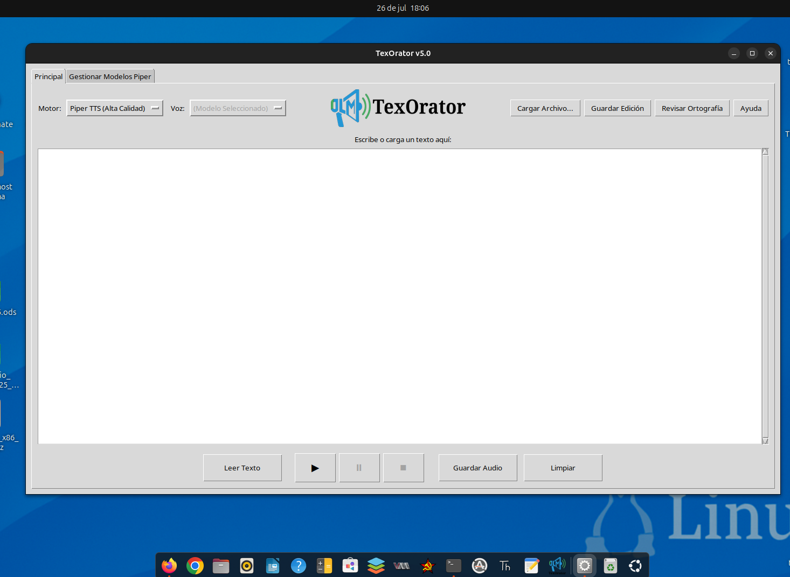

# TexOrator

TexOrator es una aplicación de escritorio para Linux (derivados de Debian) que convierte texto a voz (TTS). Permite cargar documentos en formato `.pdf`, `.docx` y `.odt`, editarlos y exportar el resultado como un archivo de audio `.wav` o `.mp3`.



## Características Principales

*   **Motores de Voz:** Soporta **Piper TTS** para voces de alta calidad y **Pico TTS** para una opción más ligera y natural.
*   **Lectura de Documentos:** Abre y extrae texto de archivos PDF, DOCX y ODT.
*   **Editor Integrado:** Edita el texto extraído o escribe desde cero antes de convertirlo a voz.
*   **Corrector Ortográfico y Gramatical:** Subraya errores y ofrece sugerencias (requiere librerías adicionales).
*   **Gestor de Modelos:** Carga fácilmente nuevas voces para Piper TTS.
*   **Exportación de Audio:** Guarda el resultado como `.wav` o `.mp3` (requiere `ffmpeg` para MP3).

## Instalación

Tienes dos maneras de instalar TexOrator.

### Opción 1: Usando el paquete .deb (Recomendado)

Dirígete a la sección de [**Releases**](https://github.com/jlmbsas/TexOrator/releases) en este repositorio y descarga el último archivo `.deb`. Luego, puedes instalarlo con:

```bash
sudo dpkg -i TexOrator_v5.2_amd64.deb
sudo apt-get install -f # Para instalar las dependencias faltantes

 Opción 2: Desde el código fuente

Este método es para usuarios avanzados que deseen modificar el código.

1. Instalar Dependencias del Sistema:
Generated bash

      
sudo apt-get update
sudo apt-get install python3-tk python3-venv ffmpeg libespeak-ng1 libportaudio2 pico2wave

    

IGNORE_WHEN_COPYING_START
Use code with caution. Bash
IGNORE_WHEN_COPYING_END

2. Clonar el Repositorio:
Generated bash

      
git clone https://github.com/TU_USUARIO/TexOrator.git
cd TexOrator

    

IGNORE_WHEN_COPYING_START
Use code with caution. Bash
IGNORE_WHEN_COPYING_END

3. Crear un Entorno Virtual e Instalar Dependencias de Python:
Generated bash

      
python3 -m venv venv
source venv/bin/activate
pip install -r requirements.txt

    

IGNORE_WHEN_COPYING_START
Use code with caution. Bash
IGNORE_WHEN_COPYING_END
Uso

Si instalaste desde el código fuente, ejecuta la aplicación con:
Generated bash

      
python3 src/texorator.py

    

IGNORE_WHEN_COPYING_START
Use code with caution. Bash
IGNORE_WHEN_COPYING_END

Si lo instalaste con el .deb, deberías encontrar "TexOrator" en tu menú de aplicaciones.
